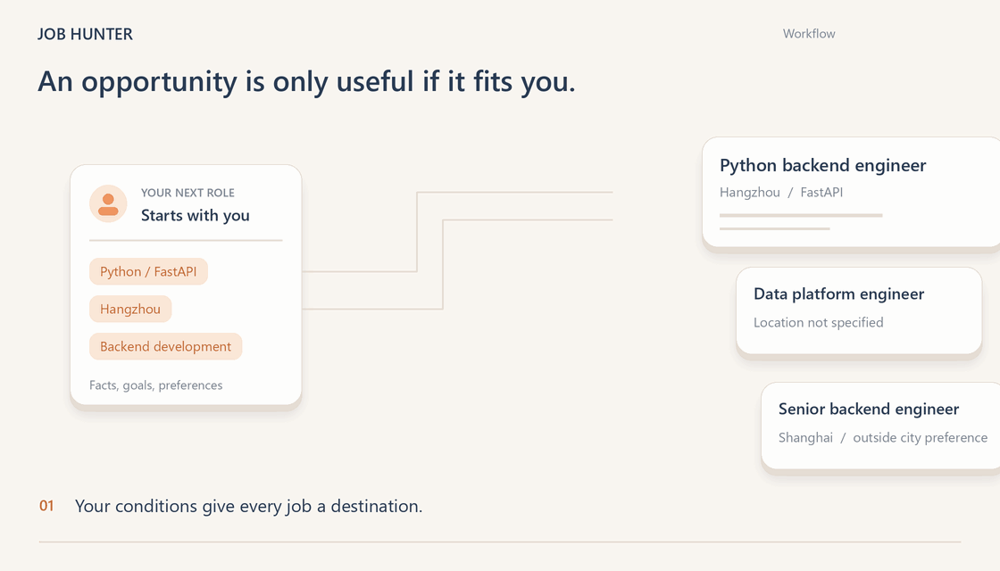
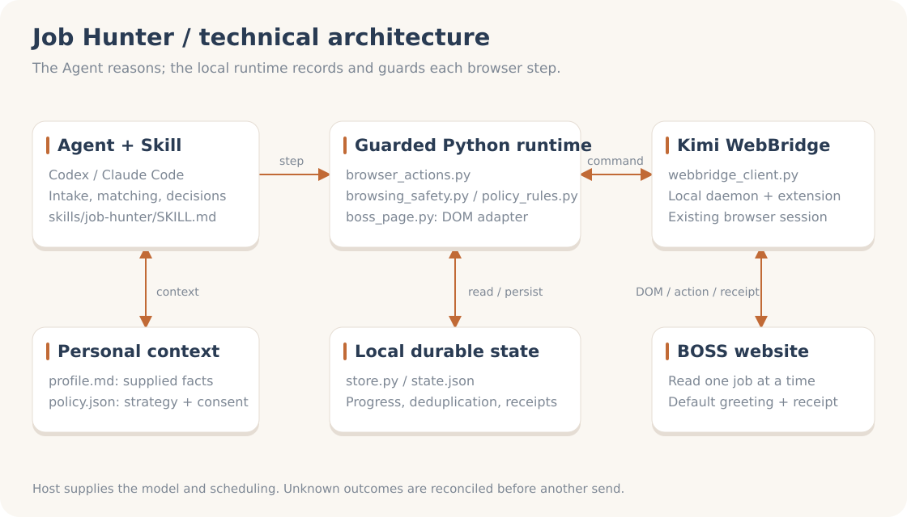

# JevHunter

**Screen jobs with Jev. Let your agent apply and follow up.**

[](https://docs.typesafe.ai/) [](https://github.com/ShiqinGuo/jev-hunter/releases/latest) [](https://github.com/ShiqinGuo/jev-hunter/actions/workflows/test.yml) [](LICENSE)

[简体中文](README.md) · [Install](#installation) · [What Jev does](#what-jev-does) · [Supported scope](#supported-scope) · [Architecture](#architecture)

**JevHunter is an AI job application plugin with [TypeSafe Jev](https://docs.typesafe.ai/) for job matching.** Jev judges which roles deserve a closer look and whether they fit. Codex / Claude Code reads the full descriptions, handles outreach and follows up with recruiters. The plugin tracks each step and its receipt.

Works with **Codex, Claude Code and compatible Agent Skills hosts**. Live browser outreach currently supports **BOSS Zhipin / BOSS 直聘** through Kimi WebBridge. Jev is optional and requires the setup below.



[Static image](docs/media/demo-poster.en.png)

## From job matching to follow-up

- **Find roles worth reading:** compare the full job description with your experience and preferences; keep evidence and missing information visible.
- **Review a group:** collect up to five job descriptions sequentially, review them together, then recheck each role before outreach.
- **Act on your choices:** initiate authorized conversations, reply to recruiters, share your platform resume and verify receipts.
- **Resume your search:** keep candidate decisions and checkpoints; reconcile uncertain outcomes before sending again.

## What Jev does

[Jev](https://docs.typesafe.ai/) is TypeSafe's System One model for typed decisions and probabilities. JevHunter uses it at two semantic decision points:

| Step | Jev judgment | What happens next |
|---|---|---|
| List screening | Which roles deserve a closer look | The agent reads candidate job descriptions |
| Detail review | `apply` / `skipped` / `deferred`, plus eligibility | Facts, rules and authorization determine outreach, skipping or further review |

Code handles explicit filters such as salary, city and experience. The host writes messages; the plugin executes browser steps through Kimi. The host calls Jev directly using the official TypeSafe Skill. Without a key or when the service is unavailable, the host performs the judgment and records its source.

### Small judgments inside a complete workflow

```text
Your preferences + current jobs
               ↓
Rule filters → Jev: worth reading? eligible?
               ↓
Agent: read the JD, explain the match, prepare outreach
               ↓
Plugin: authorized outreach → verify receipt → save progress
```

The same separation appears in [Jevmail](https://github.com/fazlerocks/jevmail) for email classification, [fast-jev-compaction](https://github.com/tamaratran/fast-jev-compaction) for context retention, and [jev-ultrafast](https://github.com/browser-use/jev-ultrafast) for browser action selection. JevHunter applies it to job matching: Jev makes focused judgments; the application owns the workflow.

**Verified in v0.6.0:** 236 local tests passed, and a synthetic job evaluation succeeded through the Jev API. Improvements in real-job matching accuracy, cost and end-to-end time have not been measured. See [validation](VALIDATION.md). The animation illustrates the workflow under the former Job Hunter name.

## Installation

Formerly Job Hunter. The plugin ID remains `job-hunter` to preserve existing installations and local data.

Use Python 3.10+ and a host that supports plugins or Skills. The base workflow uses your host model. Enabling Jev requires a separate TypeSafe API key.

**Codex**, using a CLI that provides `plugin add`:

```sh
codex plugin marketplace add ShiqinGuo/jev-hunter
codex plugin add job-hunter@job-hunter
```

**Claude Code:**

```sh
claude plugin marketplace add ShiqinGuo/jev-hunter
claude plugin install job-hunter@job-hunter
```

Alternatively, download the [latest release](https://github.com/ShiqinGuo/jev-hunter/releases/latest) and install the complete `skills/job-hunter` directory into your host's Skill directory. Load it in a new conversation after installation or upgrade.

Before the first browser task, open the [Kimi Browser Extension / Kimi WebBridge setup guide](https://www.kimi.com/en/products/kimi-webbridge) and choose the local-Agent setup. Install and connect the extension and daemon, make its Skill available to the host, and log in to BOSS in that browser. Installing JevHunter does not install these browser components. Ask the Agent to verify the connection and login state. You can analyze a supplied resume and job description before browser setup.

### Enable Jev (optional)

Install the [official TypeSafe Skill](https://github.com/typesafe-ai/skills) using one method for your host.

**Codex:**

```sh
npx skills add typesafe-ai/skills --skill typesafe-ai --agent codex --global
```

**Claude Code:**

```sh
claude plugin marketplace add typesafe-ai/skills
claude plugin install typesafe@typesafe-ai
```

Set `TYPESAFE_API_KEY` in your local environment and restart the host to inherit it. On Windows, the host can also read the current user's environment directly. Keep the key out of chat, source files and job-search configuration. Jev requests send the job text and matching context needed for that judgment to TypeSafe. Installing JevHunter does not install the TypeSafe Skill or configure its key.

### Start your first search

Start with:

> Use JevHunter to find five roles that fit my resume and preferences. Use Jev to help screen them, show the evidence and gaps, and do not send messages yet.

## Architecture



The diagram shows the base execution path. Jev is an optional judgment service called by the host through the official TypeSafe Skill. The host reasons using JevHunter; `browser_actions.py` routes individual steps through policy and browsing checks, a BOSS DOM adapter and `webbridge_client.py`. `store.py` persists checkpoints, deduplication and receipts.

Personal facts (`profile.md`), strategy and authorization (`policy.json`), and progress (`state.json`) live in a local data directory. Release packages exclude personal resumes, chats and application records. Preserve that directory during upgrades.

## Supported scope

| Area | Current boundary |
|---|---|
| BOSS 直聘 / BOSS Zhipin | Filters, visible lists, detail groups and platform-default greetings through the guarded entry |
| Other job sites | Analyze supplied material; site-by-site browser execution is not yet adapted and verified |
| Normal replies and platform resume sharing | Wired into the entry; live replies and share requests verified. Final attachment delivery still requires an explicit receipt after recipient consent |
| Custom first greetings | Drafting supported; new conversations use the platform-default greeting |
| Scheduled runs | Depend on the host scheduler, computer and browser availability |

Real-site validation includes a single authorized greeting and delayed receipt reconciliation. See [validation evidence](VALIDATION.md) and [browser rules](skills/job-hunter/references/browsing-safety.md).

## Documentation and contributing

[Matching rules](skills/job-hunter/references/matching.md) · [Runtime guide](skills/job-hunter/references/runtime.md) · [Validation](VALIDATION.md) · [Changelog](CHANGELOG.md) · [Contributing](CONTRIBUTING.md) · [Issues](https://github.com/ShiqinGuo/jev-hunter/issues)

[Animation sources and static alternatives](docs/media/README.md). Licensed under [MIT](LICENSE).
