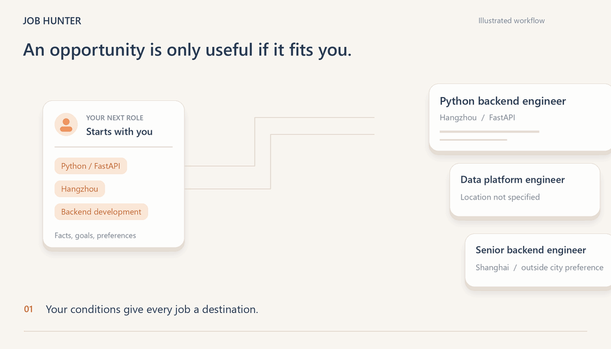

# Job Hunter

**Find jobs that fit your experience. Understand why. Pick up where you left off.**

[简体中文](README.md) · [Install](#installation) · [Supported scope](#supported-scope) · [Architecture](#architecture)

Job Hunter is a job-search plugin for **Codex**, **Claude Code** and compatible Agent Skill hosts. Give it your resume and goals; it helps clarify the conditions that matter, reads jobs one at a time, explains the match and tracks progress locally. Outreach uses your explicit authorization and checks the platform receipt.



*Program-drawn feature illustration with fictional data, not a product UI recording. [Static alternative](docs/media/demo-poster.png).*

## Installation
Use Python 3.10+ and a host that supports plugins or Skills. The host supplies the model; the plugin does not require a separate model API key.

**Codex**, using a CLI that provides `plugin add`:

```sh
codex plugin marketplace add ShiqinGuo/job-hunter
codex plugin add job-hunter@job-hunter
```

**Claude Code:**

```sh
claude plugin marketplace add ShiqinGuo/job-hunter
claude plugin install job-hunter@job-hunter
```

Alternatively, download the [latest release](https://github.com/ShiqinGuo/job-hunter/releases/latest) and install the complete `skills/job-hunter` directory into your host's Skill directory. Load it in a new conversation after installation or upgrade.

Before the first browser task, open the [Kimi Browser Extension / Kimi WebBridge setup guide](https://www.kimi.com/en/products/kimi-webbridge) and choose the local-Agent setup. Install and connect the extension and daemon, make its Skill available to the host, and log in to BOSS in that browser. Installing Job Hunter does not install these browser components. Ask the Agent to verify the connection and login state. You can analyze a supplied resume and job description before browser setup.

Browser execution uses **Kimi Browser Extension / Kimi WebBridge**, including its Skill, local daemon and a logged-in browser session. It does not automatically switch browser channels. Local analysis and drafts can continue when that channel is unavailable.


Start with:

> Based on my resume and preferences, find five suitable roles and explain the evidence and gaps. Do not send messages yet. Ask only for missing information that changes the search.

## What it helps you do
- **Resume-based job matching:** separate facts, hard requirements, preferences and missing information.
- **One job at a time:** screen the visible list, inspect details and decide the next action before continuing.
- **Authorized outreach:** use the supported platform action and verify the result.
- **Application tracking and recovery:** keep candidate decisions, checkpoints and receipts; reconcile unknown outcomes before sending again.

## Architecture


The host reasons using the Skill; `browser_actions.py` routes individual steps through policy and browsing checks, a BOSS DOM adapter and `webbridge_client.py`. `store.py` persists checkpoints, deduplication and receipts. The guarded entry governs operations made through it; it is not a browser sandbox for unrelated scripts.

Personal facts (`profile.md`), strategy and authorization (`policy.json`), and progress (`state.json`) live in a local data directory. Release packages exclude personal resumes, chats and application records. Preserve that directory during upgrades.

## Supported scope
| Area | Current boundary |
|---|---|
| BOSS 直聘 / BOSS Zhipin | Filters, visible lists, individual details and platform-default greetings through the guarded entry |
| Other job sites | Analyze supplied material; site-by-site browser execution is not yet adapted and verified |
| Custom greetings, normal replies, attachments | Preparation is supported; sending is not wired into the current browser entry |
| Scheduled runs | Depend on the host scheduler, computer and browser availability |

Real-site validation includes a single authorized greeting and delayed receipt reconciliation. It does not establish bulk-outreach reliability or immunity from platform restrictions. See [validation evidence](VALIDATION.md) and [browser rules](skills/job-hunter/references/browsing-safety.md).

## Documentation and contributing
[Matching rules](skills/job-hunter/references/matching.md) · [Runtime guide](skills/job-hunter/references/runtime.md) · [Validation](VALIDATION.md) · [Changelog](CHANGELOG.md) · [Contributing](CONTRIBUTING.md) · [Issues](https://github.com/ShiqinGuo/job-hunter/issues)

[Animation sources and static alternatives](docs/media/README.md). Licensed under [MIT](LICENSE).
