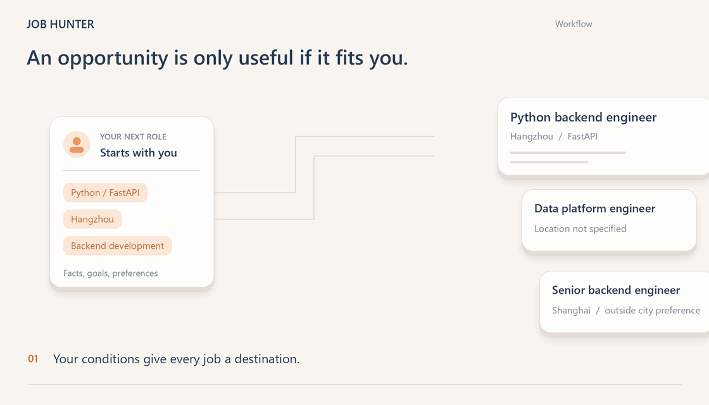
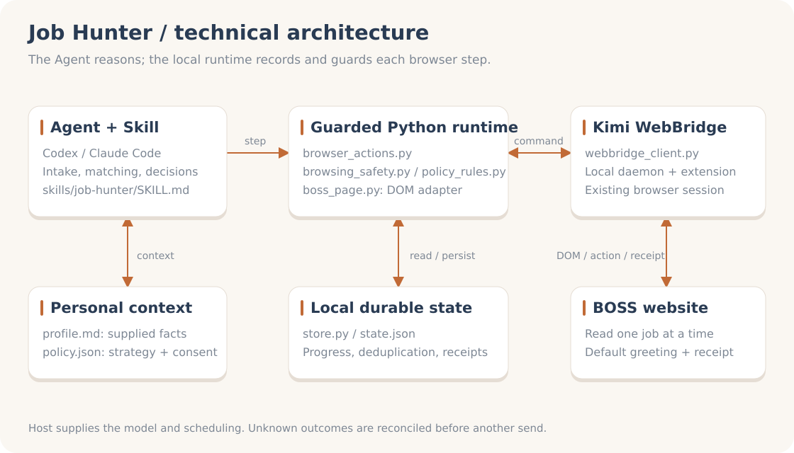

# Jev4JobHunter

**Screen jobs with Jev. Let your agent apply and follow up.**

[](https://docs.typesafe.ai/) [](https://github.com/ShiqinGuo/jev4jobhunter/releases/latest) [](https://github.com/ShiqinGuo/jev4jobhunter/actions/workflows/test.yml) [](LICENSE)

[简体中文](README.md) · [Install](#installation) · [What Jev does](#what-jev-does) · [Supported scope](#supported-scope) · [Architecture](#architecture)

**Jev4JobHunter is an AI job application plugin with [TypeSafe Jev](https://docs.typesafe.ai/) for job matching.** The plugin collects complete JDs; Jev makes one batch decision about initial contact. Codex / Claude Code handles authorized outreach and recruiter follow-up, with recorded receipts.

Works with **Codex, Claude Code and compatible Agent Skills hosts**. Live browser outreach currently supports **BOSS Zhipin / BOSS 直聘** through Kimi WebBridge. Jev is optional and requires the setup below.



[Static image](docs/media/demo-poster.en.png)

## What Jev does

[Jev](https://docs.typesafe.ai/) evaluates a whole batch of complete job descriptions in one call, with one boolean per job: is it worth initiating contact? Accepted jobs enter the authorized queue directly. The host checks the full policy during recruiter conversations and explains relevant, factual experience.

Code enforces explicit exclusions, deduplication, authorization and platform restrictions. Browser actions use Kimi. The [Android adapter](skills/job-hunter/references/android.md) uses ADB for UI actions and passively captures their existing responses; it never calls or replays recruiting APIs. A calibrated gesture is reused for loading. List summaries are never treated as complete JDs.

## Installation

Formerly Job Hunter. The plugin ID remains `job-hunter` to preserve existing installations and local data.

Use Python 3.10+ and a host that supports plugins or Skills. The base workflow uses your host model. Enabling Jev requires a separate TypeSafe API key.

**Codex**, using a CLI that provides `plugin add`:

```sh
codex plugin marketplace add ShiqinGuo/jev4jobhunter
codex plugin add job-hunter@job-hunter
```

**Claude Code:**

```sh
claude plugin marketplace add ShiqinGuo/jev4jobhunter
claude plugin install job-hunter@job-hunter
```

Alternatively, download the [latest release](https://github.com/ShiqinGuo/jev4jobhunter/releases/latest) and install the complete `skills/job-hunter` directory into your host's Skill directory. Load it in a new conversation after installation or upgrade.

Before the first browser task, open the [Kimi Browser Extension / Kimi WebBridge setup guide](https://www.kimi.com/en/products/kimi-webbridge) and choose the local-Agent setup. Install and connect the extension and daemon, make its Skill available to the host, and log in to BOSS in that browser. Installing Jev4JobHunter does not install these browser components. Ask the Agent to verify the connection and login state. You can analyze a supplied resume and job description before browser setup.

### Enable Jev (optional)

The built-in Jev runner needs no additional Skill installation.

Set `TYPESAFE_API_KEY` in your local environment and restart the host to inherit it. On Windows, the host can also read the current user's environment directly. Keep the key out of chat, source files and job-search configuration. Jev requests send the job text and matching context needed for that judgment to TypeSafe. Installing Jev4JobHunter does not install the TypeSafe Skill or configure its key.

### Start your first search

Start with:

> Use Jev4JobHunter to find five roles that fit my resume and preferences. Use Jev to help screen them, show the evidence and gaps, and do not send messages yet.

## Architecture



The diagram shows the base execution path. The optional `jev.py` runner batches typed questions over stored evidence and rejects stale results. The host reasons using Jev4JobHunter; `browser_actions.py` routes business steps through policy and browsing checks, a BOSS DOM adapter and `webbridge_client.py`. `store.py` persists checkpoints, deduplication and receipts.

Personal facts (`profile.md`), strategy and authorization (`policy.json`), and progress (`state.json`) live in a local data directory. Release packages exclude personal resumes, chats and application records. Preserve that directory during upgrades.

## Supported scope

| Area | Current boundary |
|---|---|
| BOSS 直聘 / BOSS Zhipin | Filters, visible lists, detail groups and platform-default greetings through the guarded entry |
| Other job sites | Analyze supplied material; site-by-site browser execution is not yet adapted and verified |
| Normal replies and platform resume sharing | Wired into the entry; live replies and share requests verified. Final attachment delivery still requires an explicit receipt after recipient consent |
| Android response capture | Lists and full JDs verified on an unrooted phone with the official app; fixed gesture reuse. Mobile send receipts still need live validation |
| Custom first greetings | Drafting supported; new conversations use the platform-default greeting |
| Scheduled runs | Depend on the host scheduler, computer and browser availability |

Real-site validation includes a single authorized greeting and delayed receipt reconciliation. See [validation evidence](VALIDATION.md) and [browser rules](skills/job-hunter/references/browsing-safety.md).

## Documentation and contributing

[Matching rules](skills/job-hunter/references/matching.md) · [Runtime guide](skills/job-hunter/references/runtime.md) · [Validation](VALIDATION.md) · [Changelog](CHANGELOG.md) · [Contributing](CONTRIBUTING.md) · [Issues](https://github.com/ShiqinGuo/jev4jobhunter/issues)

[Animation sources and static alternatives](docs/media/README.md). Licensed under [MIT](LICENSE).
