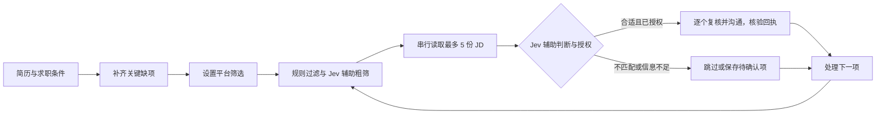

<h1 align="center">JevHunter</h1>
<p align="center">用 Jev 筛岗位，让 Agent 完成投递与跟进。</p>
<p align="center">
  <a href="https://docs.typesafe.ai/"></a>
  <a href="https://github.com/ShiqinGuo/jev-hunter/releases/latest"></a>
  <a href="https://github.com/ShiqinGuo/jev-hunter/actions/workflows/test.yml"></a>
  <a href="LICENSE"></a>
</p>
<p align="center"><a href="README.en.md">English</a> · <a href="#快速开始">快速开始</a> · <a href="#jev-负责什么">Jev 负责什么</a> · <a href="#技术架构">技术架构</a> · <a href="#当前支持范围">支持范围</a> · <a href="CHANGELOG.md">更新记录</a> · <a href="https://github.com/ShiqinGuo/jev-hunter/issues">反馈问题</a></p>

**JevHunter 是结合 [TypeSafe Jev](https://docs.typesafe.ai/) 的 AI 求职投递插件。** Jev 判断哪些岗位值得看、是否匹配；Codex / Claude Code 阅读完整 JD、组织投递和 HR 跟进；插件记录每一步结果。把简历和求职条件交给 Agent，从找岗位推进到有回执的沟通。

适用于 **Codex、Claude Code 和兼容 Agent Skills 的宿主**；当前网页投递支持 **BOSS 直聘（BOSS Zhipin）**，通过 Kimi WebBridge 操作你已登录的浏览器。Jev 可选启用，配置方式见下方。


[静态图](docs/media/demo-poster.zh-CN.png)

**开始使用：** [Codex / Claude Code 安装](#快速开始) · [下载插件](https://github.com/ShiqinGuo/jev-hunter/releases/latest) · [真实验证范围](VALIDATION.md)

## 从筛选到投递，一次接着一次

- **筛出值得看的岗位**：结合简历、求职条件与完整 JD 判断匹配，记录理由和缺失信息。
- **读完一组再决定**：同一页面串行收集最多 5 份 JD，整组判断；投递前逐个重新核对。
- **把投递做完**：按你的授权发起沟通、回复 HR、分享平台简历，并核验对应回执。
- **下次接着找**：保存候选、处理进度和已联系记录，中断后继续，结果不明先核对。

## Jev 负责什么

[Jev](https://docs.typesafe.ai/) 是 TypeSafe 的 System One 模型，返回选择与概率。JevHunter 在需要理解岗位语义的两个环节使用它：

| 环节 | Jev 的判断 | 后续动作 |
|---|---|---|
| 列表粗筛 | 哪些岗位值得打开详情 | Agent 逐个读取候选 JD |
| 详情判断 | `apply` / `skipped` / `deferred`，以及资格是否符合 | 结合事实、规则和授权，投递、跳过或保留待确认 |

薪资、城市、经验等明确条件先由规则过滤；沟通文案由宿主 Agent 生成，网页操作由插件通过 Kimi 执行。Jev 通过官方 Skill 由宿主直接调用；未配置或服务不可用时，回退为宿主判断并标明来源。

### 小判断，接进完整求职流程

```text
你的条件 + 当前岗位
        ↓
规则过滤 → Jev：值得看吗？符合要求吗？
        ↓
Agent：阅读 JD、解释匹配、准备沟通
        ↓
插件：执行已授权投递 → 核验回执 → 保存进度
```

这种分工也见于 [Jevmail](https://github.com/fazlerocks/jevmail) 的邮件分类、[fast-jev-compaction](https://github.com/tamaratran/fast-jev-compaction) 的上下文保留判断，以及 [jev-ultrafast](https://github.com/browser-use/jev-ultrafast) 的浏览器动作选择。JevHunter 把同样的“判断交给 Jev，流程交给应用”用在岗位匹配上。

**已验证：** v0.6.0 本地 236 项测试通过；虚构岗位 Jev API 调用成功。当前尚未测出 Jev 对真实岗位筛选准确率、费用或端到端耗时的改善，详见 [验证记录](VALIDATION.md)。上方动画沿用 Job Hunter 名称，是功能示意。

## 快速开始

需要支持 Skill 的 Agent 宿主和 **Python 3.10+**。核心 Python 脚本仅使用标准库；执行网页操作还需要当前入口支持的浏览器通道。基础流程使用宿主模型；启用 Jev 需要另行配置 TypeSafe API key。

### 1. 安装到 Agent 宿主

项目原名 Job Hunter，插件安装标识仍为 `job-hunter`，已有数据目录与安装方式保持兼容。

#### Codex

使用提供 `plugin add` 的 Codex CLI：

```sh
codex plugin marketplace add ShiqinGuo/jev-hunter
codex plugin add job-hunter@job-hunter
```

若当前 CLI 没有 `plugin add`，在客户端插件目录中安装，或使用客户端附带的新版可执行文件。升级已有安装时先运行 `codex plugin marketplace upgrade job-hunter`，再运行上面的 `plugin add`。

#### Claude Code

```sh
claude plugin marketplace add ShiqinGuo/jev-hunter
claude plugin install job-hunter@job-hunter
```

升级使用 `claude plugin marketplace update job-hunter` 和 `claude plugin update job-hunter@job-hunter`。

#### 独立 Skill

从 [Releases](https://github.com/ShiqinGuo/jev-hunter/releases) 下载发布包，将 `skills/job-hunter` **整个目录**放入宿主支持的 Skill 目录，保留 references、scripts 和 agents。也可直接在对话里指定源码路径。

### 2. 准备浏览器环境

网页筛选还需要 [Kimi 浏览器扩展与本机 daemon](https://www.kimi.com/products/kimi-webbridge)，以及宿主可读取的 `kimi-webbridge` Skill。在官方页面选择“搭配本地 Agent”，按说明完成安装和连接，在对应浏览器登录 BOSS 直聘；请先让 Agent 确认 Kimi 连接与当前登录状态。

安装 JevHunter 插件不会同时安装这些浏览器组件。暂未准备浏览器时，可以先提供简历和岗位描述做本地匹配分析。

### 3. 启用 Jev（可选）

为宿主安装 [TypeSafe 官方 Skill](https://github.com/typesafe-ai/skills)，按使用的 Agent 选择一种方式：

**Codex：**

```sh
npx skills add typesafe-ai/skills --skill typesafe-ai --agent codex --global
```

**Claude Code：**

```sh
claude plugin marketplace add typesafe-ai/skills
claude plugin install typesafe@typesafe-ai
```

在本机配置 `TYPESAFE_API_KEY` 环境变量，重新启动宿主以继承变量。Windows 也支持由宿主直接读取当前用户环境。密钥不放进聊天、仓库或求职配置；Jev 调用会将本次判断所需的岗位文本与匹配条件发送给 TypeSafe。安装 JevHunter 不会自动安装 TypeSafe Skill 或配置密钥。

### 4. 开始第一个任务

安装或升级后在新对话加载。首次可以这样说：

> 用 JevHunter 找 5 个适合我的岗位，启用 Jev 辅助筛选，列出匹配理由和信息缺口，先不发送消息。

需要执行时，把目标和授权说清楚：

> 对这些已筛选通过的岗位，使用平台当前招呼语发起沟通，逐项核验结果。

## 核心能力

| 能力 | 能帮你做什么 |
|---|---|
| 求职信息引导 | 从已有简历提取事实，只补问会改变筛选或回复的信息；回答保存后复用 |
| 有依据的岗位筛选 | 区分硬条件、软偏好和未知项；核对正式工龄、职责与完整 JD |
| 详情组阅读 | 当前批次内串行收集最多 5 份 JD、统一判断；投递前逐个复核 |
| 按授权沟通 | 已有明确授权直接使用；新沟通保留平台回执，结果不明先核对 |
| 断点与记录 | 保存候选去向、筛选进度、成功和未知动作；中断后继续，不清空历史重投 |
| 账号上下文 | 按已核验账号与限制范围处理暂停，避免旧账号记录误用于独立账号 |
| 求职复盘 | 根据已有岗位与沟通证据分析错配，形成筛选建议；不把索简历当作通过面试门槛 |
| 定时与日报 | 由宿主触发任务，插件记录轮次与交付，支持发现漏跑和补报 |

## 使用流程



处理完当前列表，再继续查看新增岗位。未启用 Jev 时，相应判断由宿主 Agent 完成。

## 技术架构


宿主 Agent 提供模型和推理，Skill 组织信息补充与匹配；启用 Jev 后，由宿主按官方 TypeSafe Skill 调用 API 完成语义判断。架构图展示基础执行路径，Jev 是该路径之外的可选判断服务。网页步骤经过 `browser_actions.py`、`browsing_safety.py` 和策略检查，再通过 `webbridge_client.py` 调用 Kimi；`boss_page.py` 负责页面观察与适配。`store.py` 保存进度、防重与回执。

资料、策略和状态留在本地目录；定时触发由宿主提供。[运行说明](skills/job-hunter/references/runtime.md) · [素材与生成方式](docs/media/README.md)

## 当前支持范围

| 场景 | 0.6.0 状态 |
|---|---|
| BOSS 平台筛选、列表、单个详情、默认招呼 | 已接入统一入口；已有一次真实沟通回执验证 |
| BOSS 普通回复、平台附件分享 | 已接入；普通回复及附件请求有真实回执，附件最终送达仍需对方同意后的明确回执 |
| BOSS 自定义首条招呼 | 可准备材料；当前新沟通使用平台默认招呼 |
| 其他招聘网站 / 公司招聘页 | 可分析用户提供的材料；逐站网页操作尚未适配、验收 |
| 本地策略、授权、防重、恢复与报告 | 已有自动化测试；各项验证口径见验证记录 |
| 定时执行 | 依赖宿主实际调度能力、电脑和浏览器状态 |

升级时结束当前运行，保留个人数据，在新对话重新加载。

浏览策略与恢复细节见 [页面浏览策略](skills/job-hunter/references/browsing-safety.md)；测试和实际网站记录见 [验证记录](VALIDATION.md)。

## 个人数据与恢复

每个求职方案使用独立目录，按明确的 `--data-dir` → `JOB_HUNTER_HOME` → `~/.job-hunter` 解析。同一账号共享联系历史；独立账号的上下文与适用限制须明确归属。

| 文件 | 内容 |
|---|---|
| `profile.md` | 经历事实、材料来源和用户更正 |
| `policy.json` | 求职条件、执行策略与授权 |
| `state.json` | 候选、浏览进度、账号上下文和动作回执 |
| `logs/`、`drafts/` | 运行记录与待处理材料 |

发布包不包含个人简历、账号配置、聊天或投递记录。核心状态格式保持 v2，升级保留历史；现有未完成动作先核对，再恢复浏览。

## 文档导航

| 文档 | 内容 |
|---|---|
| [信息补充引导](skills/job-hunter/references/intake.md) | 如何从模糊目标形成可执行的筛选条件 |
| [岗位匹配](skills/job-hunter/references/matching.md) | 年限、薪资、职责、排除项与证据 |
| [浏览器选择](skills/job-hunter/references/drivers.md) | 通道选择、登录与恢复 |
| [运行指南](skills/job-hunter/references/runtime.md) | 单步入口、配置、授权与动作命令 |
| [验证记录](VALIDATION.md) | 离线测试、实际网站结果和未验证范围 |
| [贡献说明](CONTRIBUTING.md) | 开发、测试和问题反馈 |
| [维护方向](ROADMAP.md) | 后续适配与验证工作 |

## 最近更新

| 版本 | 日期 | 主要变化 |
|---|---|---|
| **0.6.0** | 2026-09-21 | 详情组批量阅读、Jev 判断指引与 Codex / Windows 适配 |
| 0.5.0 | 2026-09-20 | 会话闭环、条件等待、操作测量与断点恢复 |
| **0.4.1** | 2026-09-16 | 固定 Kimi 通道、压缩后恢复与查询约束 |
| 0.4.0 | 2026-09-15 | 逐步浏览检查、账号上下文、页面适配、资料变更后重审和信息引导 |
| 0.3.0 | 2026-09-08 | 结构化授权、申请防重、策略更新、运行恢复与日报补报 |

完整记录见 [CHANGELOG.md](CHANGELOG.md)。欢迎提交脱敏复现和改进建议；项目采用 [MIT](LICENSE) 许可证。
