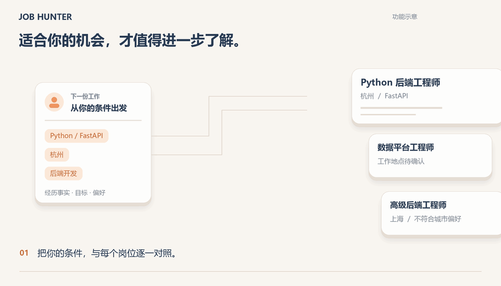
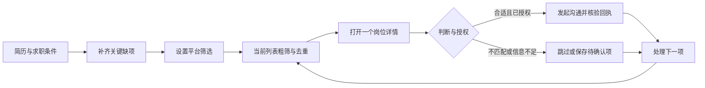
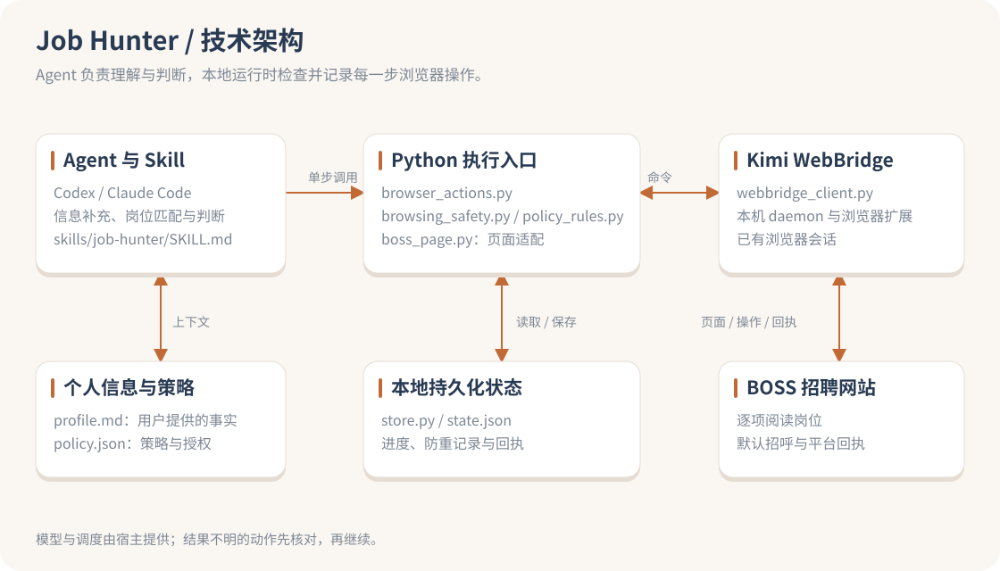

<h1 align="center">Job Hunter</h1>
<p align="center">让 Agent 按你的条件筛岗位，解释匹配理由，并记住每一步进展。</p>
<p align="center">
  <a href="https://github.com/ShiqinGuo/job-hunter/releases/latest"></a>
  <a href="https://github.com/ShiqinGuo/job-hunter/actions/workflows/test.yml"></a>
  <a href="LICENSE"></a>
</p>
<p align="center"><a href="README.en.md">English</a> · <a href="#快速开始">快速开始</a> · <a href="#技术架构">技术架构</a> · <a href="#当前支持范围">支持范围</a> · <a href="CHANGELOG.md">更新记录</a> · <a href="https://github.com/ShiqinGuo/job-hunter/issues">反馈问题</a></p>

**Job Hunter** 是面向个人求职的 Agent 插件，也可作为独立 Skill 使用。你提供简历和目标，Agent 帮你补齐影响筛选的信息、阅读岗位、解释匹配理由，并按明确授权推进沟通。个人资料和执行记录保存在本地目录。



[静态图](docs/media/demo-poster.zh-CN.png)

**开始使用：** [Codex / Claude Code 安装](#快速开始) · [下载插件](https://github.com/ShiqinGuo/job-hunter/releases/latest) · [真实验证范围](VALIDATION.md)

支持 **Codex、Claude Code 和兼容 Skill 的宿主**。当前网页执行适配 **BOSS 直聘**，使用 **Kimi Browser Extension / Kimi WebBridge**；其他网站可先分析用户提供的材料，具体支持范围见下文。

0.5.0 增加会话/详情条件等待和已审阅回复的执行闭环，保留逐步操作与完整本地证据。测量口径和真实验证边界见 [VALIDATION.md](VALIDATION.md)。

## 快速开始

需要支持 Skill 的 Agent 宿主和 **Python 3.10+**。核心 Python 脚本仅使用标准库；执行网页操作还需要当前入口支持的浏览器通道。无需为插件单独配置模型 API Key，模型由宿主提供。

### 1. 安装到 Agent 宿主

#### Codex

使用提供 `plugin add` 的 Codex CLI：

```sh
codex plugin marketplace add ShiqinGuo/job-hunter
codex plugin add job-hunter@job-hunter
```

若当前 CLI 没有 `plugin add`，在客户端插件目录中安装，或使用客户端附带的新版可执行文件。升级已有安装时先运行 `codex plugin marketplace upgrade job-hunter`，再运行上面的 `plugin add`。

#### Claude Code

```sh
claude plugin marketplace add ShiqinGuo/job-hunter
claude plugin install job-hunter@job-hunter
```

升级使用 `claude plugin marketplace update job-hunter` 和 `claude plugin update job-hunter@job-hunter`。

#### 独立 Skill

从 [Releases](https://github.com/ShiqinGuo/job-hunter/releases) 下载发布包，将 `skills/job-hunter` **整个目录**放入宿主支持的 Skill 目录，保留 references、scripts 和 agents。也可直接在对话里指定源码路径。

### 2. 准备浏览器环境

网页筛选还需要 [Kimi 浏览器扩展与本机 daemon](https://www.kimi.com/products/kimi-webbridge)，以及宿主可读取的 `kimi-webbridge` Skill。在官方页面选择“搭配本地 Agent”，按说明完成安装和连接，在对应浏览器登录 BOSS 直聘；请先让 Agent 确认 Kimi 连接与当前登录状态。

安装 Job Hunter 插件不会同时安装这些浏览器组件。暂未准备浏览器时，可以先提供简历和岗位描述做本地匹配分析。

### 3. 开始第一个任务

安装或升级后在新对话加载。首次可以这样说：

> 根据我的简历和求职条件，先找 5 个合适岗位，说明匹配依据和缺口；暂不发送消息。只问我会影响当前筛选的缺失信息。

需要执行时，把目标和授权说清楚：

> 对这些已筛选通过的岗位，使用平台当前招呼语发起沟通，逐项核验结果。

## 核心能力

| 能力 | 能帮你做什么 |
|---|---|
| 求职信息引导 | 从已有简历提取事实，只补问会改变筛选或回复的信息；回答保存后复用 |
| 有依据的岗位筛选 | 区分硬条件、软偏好和未知项；核对正式工龄、职责与完整 JD |
| 逐岗位处理 | 先设置平台筛选，再读当前列表；一次打开一个详情，处理完当前批次才继续滚动 |
| 按授权沟通 | 已有明确授权直接使用；新沟通保留平台回执，结果不明先核对 |
| 断点与记录 | 保存候选去向、筛选进度、成功和未知动作；中断后继续，不清空历史重投 |
| 账号上下文 | 按已核验账号与限制范围处理暂停，避免旧账号记录误用于独立账号 |
| 求职复盘 | 根据已有岗位与沟通证据分析错配，形成筛选建议；不把索简历当作通过面试门槛 |
| 定时与日报 | 由宿主触发任务，插件记录轮次与交付，支持发现漏跑和补报 |

## 使用流程



处理完当前列表，再继续查看新增岗位。

## 技术架构



宿主 Agent 提供模型和推理，Skill 组织信息补充与匹配。网页步骤经过 `browser_actions.py`、`browsing_safety.py` 和策略检查，再通过 `webbridge_client.py` 调用 Kimi；`boss_page.py` 负责页面观察与适配。`store.py` 保存进度、防重与回执。

资料、策略和状态留在本地目录；定时触发由宿主提供。[运行说明](skills/job-hunter/references/runtime.md) · [素材与生成方式](docs/media/README.md)

## 当前支持范围

| 场景 | 0.5.0 状态 |
|---|---|
| BOSS 平台筛选、列表、单个详情、默认招呼 | 已接入统一入口；已有一次真实沟通回执验证 |
| BOSS 普通回复、平台附件分享 | 已接入；普通回复及附件请求有真实回执，附件最终送达仍需对方同意后的明确回执 |
| BOSS 自定义首条招呼 | 可准备材料；当前新沟通使用平台默认招呼 |
| 其他招聘网站 / 公司招聘页 | 可分析用户提供的材料；逐站网页操作尚未适配、验收 |
| 本地策略、授权、防重、恢复与报告 | 已有自动化测试；各项验证口径见验证记录 |
| 定时执行 | 依赖宿主实际调度能力、电脑和浏览器状态 |

升级时结束当前运行，保留个人数据，在新对话重新加载。

浏览策略与恢复细节见 [页面浏览策略](skills/job-hunter/references/browsing-safety.md)；测试和实际网站记录见 [验证记录](VALIDATION.md)。

## 个人数据与恢复

每个求职方案使用独立目录，按明确的 `--data-dir` → `JOB_HUNTER_HOME` → `~/.job-hunter` 解析。同一账号共享联系历史；独立账号的上下文与适用限制须明确归属。

| 文件 | 内容 |
|---|---|
| `profile.md` | 经历事实、材料来源和用户更正 |
| `policy.json` | 求职条件、执行策略与授权 |
| `state.json` | 候选、浏览进度、账号上下文和动作回执 |
| `logs/`、`drafts/` | 运行记录与待处理材料 |

发布包不包含个人简历、账号配置、聊天或投递记录。核心状态格式保持 v2，升级保留历史；现有未完成动作先核对，再恢复浏览。

## 文档导航

| 文档 | 内容 |
|---|---|
| [信息补充引导](skills/job-hunter/references/intake.md) | 如何从模糊目标形成可执行的筛选条件 |
| [岗位匹配](skills/job-hunter/references/matching.md) | 年限、薪资、职责、排除项与证据 |
| [浏览器选择](skills/job-hunter/references/drivers.md) | 通道选择、登录与恢复 |
| [运行指南](skills/job-hunter/references/runtime.md) | 单步入口、配置、授权与动作命令 |
| [验证记录](VALIDATION.md) | 离线测试、实际网站结果和未验证范围 |
| [贡献说明](CONTRIBUTING.md) | 开发、测试和问题反馈 |
| [维护方向](ROADMAP.md) | 后续适配与验证工作 |

## 最近更新

| 版本 | 日期 | 主要变化 |
|---|---|---|
| **0.5.0** | 2026-09-20 | 会话闭环、条件等待、操作测量与断点恢复 |
| **0.4.1** | 2026-09-16 | 固定 Kimi 通道、压缩后恢复与查询约束 |
| 0.4.0 | 2026-09-15 | 逐步浏览检查、账号上下文、页面适配、资料变更后重审和信息引导 |
| 0.3.0 | 2026-09-08 | 结构化授权、申请防重、策略更新、运行恢复与日报补报 |

完整记录见 [CHANGELOG.md](CHANGELOG.md)。欢迎提交脱敏复现和改进建议；项目采用 [MIT](LICENSE) 许可证。
