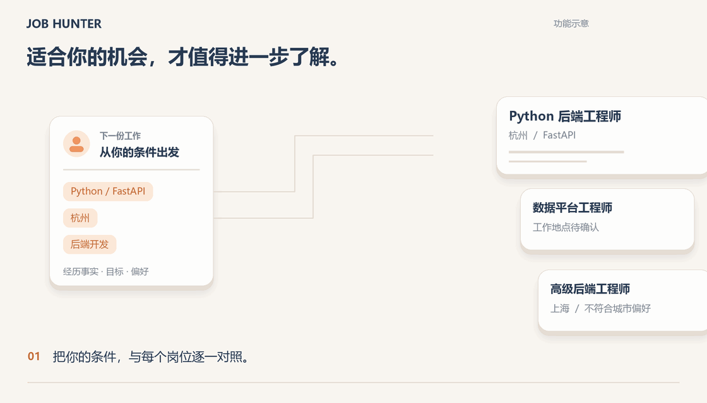
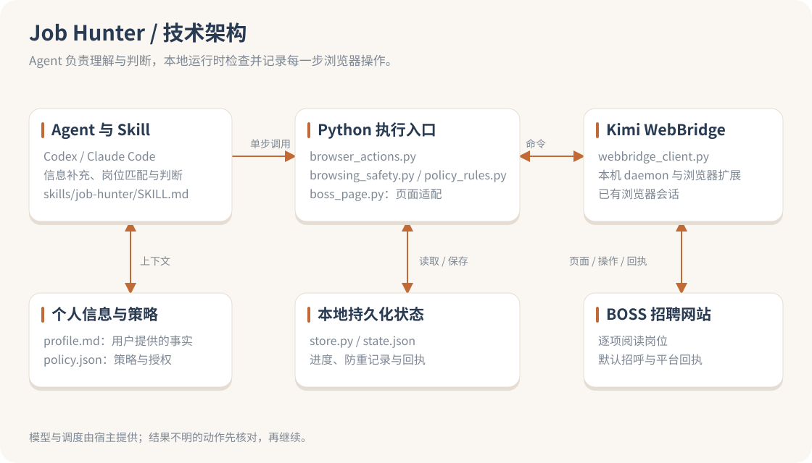

<h1 align="center">Jev4JobHunter</h1>
<p align="center">用 Jev 筛岗位，让 Agent 完成投递与跟进。</p>
<p align="center">
  <a href="https://docs.typesafe.ai/"></a>
  <a href="https://github.com/ShiqinGuo/jev4jobhunter/releases/latest"></a>
  <a href="https://github.com/ShiqinGuo/jev4jobhunter/actions/workflows/test.yml"></a>
  <a href="LICENSE"></a>
</p>
<p align="center"><a href="README.en.md">English</a> · <a href="#快速开始">快速开始</a> · <a href="#jev-负责什么">Jev 负责什么</a> · <a href="#技术架构">技术架构</a> · <a href="#当前支持范围">支持范围</a> · <a href="CHANGELOG.md">更新记录</a> · <a href="https://github.com/ShiqinGuo/jev4jobhunter/issues">反馈问题</a></p>

**Jev4JobHunter 是结合 [TypeSafe Jev](https://docs.typesafe.ai/) 的 AI 求职投递插件。** 插件收齐完整 JD，Jev 一次批量判断是否值得沟通；Codex / Claude Code 组织投递和 HR 跟进，插件记录结果。把简历和求职条件交给 Agent，从找岗位推进到有回执的沟通。

适用于 **Codex、Claude Code 和兼容 Agent Skills 的宿主**；当前网页投递支持 **BOSS 直聘（BOSS Zhipin）**，通过 Kimi WebBridge 操作你已登录的浏览器。Jev 可选启用，配置方式见下方。



[静态图](docs/media/demo-poster.zh-CN.png)

**开始使用：** [Codex / Claude Code 安装](#快速开始) · [下载插件](https://github.com/ShiqinGuo/jev4jobhunter/releases/latest) · [真实验证范围](VALIDATION.md)

## Jev 负责什么

[Jev](https://docs.typesafe.ai/) 对整批完整 JD 一次判断，每个岗位只回答“是否值得主动沟通”。结果直接进入已授权的发送队列，不再叠加资格判断或宿主逐岗复判。沟通阶段由宿主按完整 policy 复核，并结合真实经历主动说明匹配点。

名单排除、去重、授权和平台限制由代码处理。网页使用 Kimi；[Android 真机](skills/job-hunter/references/android.md) 使用 ADB 操作按钮、滚动和打开详情，从这些操作已经产生的响应获取岗位材料，不调用或重放招聘接口。首次校准后复用固定滑动参数。Jev 未配置时可由宿主批量判断并标明来源。

## 快速开始

需要支持 Skill 的 Agent 宿主和 **Python 3.10+**。核心 Python 脚本仅使用标准库；执行网页操作还需要当前入口支持的浏览器通道。基础流程使用宿主模型；启用 Jev 需要另行配置 TypeSafe API key。

### 1. 安装到 Agent 宿主

项目原名 Job Hunter，插件安装标识仍为 `job-hunter`，已有数据目录与安装方式保持兼容。

#### Codex

使用提供 `plugin add` 的 Codex CLI：

```sh
codex plugin marketplace add ShiqinGuo/jev4jobhunter
codex plugin add job-hunter@job-hunter
```

若当前 CLI 没有 `plugin add`，在客户端插件目录中安装，或使用客户端附带的新版可执行文件。升级已有安装时先运行 `codex plugin marketplace upgrade job-hunter`，再运行上面的 `plugin add`。

#### Claude Code

```sh
claude plugin marketplace add ShiqinGuo/jev4jobhunter
claude plugin install job-hunter@job-hunter
```

升级使用 `claude plugin marketplace update job-hunter` 和 `claude plugin update job-hunter@job-hunter`。

#### 独立 Skill

从 [Releases](https://github.com/ShiqinGuo/jev4jobhunter/releases) 下载发布包，将 `skills/job-hunter` **整个目录**放入宿主支持的 Skill 目录，保留 references、scripts 和 agents。也可直接在对话里指定源码路径。

### 2. 准备浏览器环境

网页筛选还需要 [Kimi 浏览器扩展与本机 daemon](https://www.kimi.com/products/kimi-webbridge)，以及宿主可读取的 `kimi-webbridge` Skill。在官方页面选择“搭配本地 Agent”，按说明完成安装和连接，在对应浏览器登录 BOSS 直聘；请先让 Agent 确认 Kimi 连接与当前登录状态。

安装 Jev4JobHunter 插件不会同时安装这些浏览器组件。暂未准备浏览器时，可以先提供简历和岗位描述做本地匹配分析。

### 3. 启用 Jev（可选）

内置 Jev 入口无需额外安装 Skill。在本机配置 `TYPESAFE_API_KEY` 环境变量，重新启动宿主以继承变量。Windows 也支持由宿主直接读取当前用户环境。密钥不放进聊天、仓库或求职配置；Jev 调用会将本次判断所需的岗位文本与匹配条件发送给 TypeSafe。安装 Jev4JobHunter 不会自动安装 TypeSafe Skill 或配置密钥。

### 4. 开始第一个任务

安装或升级后在新对话加载。首次可以这样说：

> 用 Jev4JobHunter 找 5 个适合我的岗位，启用 Jev 辅助筛选，列出匹配理由和信息缺口，先不发送消息。

需要执行时，把目标和授权说清楚：

> 对这些已筛选通过的岗位，使用平台当前招呼语发起沟通，逐项核验结果。

## 技术架构



宿主 Agent 提供模型和推理，Skill 组织信息补充与匹配；启用 Jev 后，`jev.py` 对已保存材料批量提问，返回类型化判断并检查材料是否变化。架构图展示基础执行路径，Jev 是可选判断服务。网页步骤经过 `browser_actions.py`、`browsing_safety.py` 和策略检查，再通过 `webbridge_client.py` 调用 Kimi；`boss_page.py` 负责页面观察与适配。`store.py` 保存进度、防重与回执。

资料、策略和状态留在本地目录；定时触发由宿主提供。[运行说明](skills/job-hunter/references/runtime.md) · [素材与生成方式](docs/media/README.md)

## 当前支持范围

| 场景 | 当前状态 |
|---|---|
| BOSS 平台筛选、列表、单个详情、默认招呼 | 已接入统一入口；已有一次真实沟通回执验证 |
| BOSS 普通回复、平台附件分享 | 已接入；普通回复及附件请求有真实回执，附件最终送达仍需对方同意后的明确回执 |
| Android 真机响应采集 | 未 root 真机、官方客户端已验证列表与完整 JD；固定滑动复用，移动端发送回执仍需实际验证 |
| BOSS 自定义首条招呼 | 可准备材料；当前新沟通使用平台默认招呼 |
| 其他招聘网站 / 公司招聘页 | 可分析用户提供的材料；逐站网页操作尚未适配、验收 |
| 本地策略、授权、防重、恢复与报告 | 已有自动化测试；各项验证口径见验证记录 |
| 定时执行 | 依赖宿主实际调度能力、电脑和浏览器状态 |

升级时结束当前运行，保留个人数据，在新对话重新加载。

浏览策略与恢复细节见 [页面浏览策略](skills/job-hunter/references/browsing-safety.md)；测试和实际网站记录见 [验证记录](VALIDATION.md)。

## 个人数据与恢复

每个求职方案使用独立目录，按明确的 `--data-dir` → `JOB_HUNTER_HOME` → `~/.job-hunter` 解析。同一账号共享联系历史；独立账号的上下文与适用限制须明确归属。

| 文件 | 内容 |
|---|---|
| `profile.md` | 经历事实、材料来源和用户更正 |
| `policy.json` | 求职条件、执行策略与授权 |
| `state.json` | 候选、浏览进度、账号上下文和动作回执 |
| `logs/`、`drafts/` | 运行记录与待处理材料 |

发布包不包含个人简历、账号配置、聊天或投递记录。核心状态格式保持 v2，升级保留历史；现有未完成动作先核对，再恢复浏览。

## 文档导航

| 文档 | 内容 |
|---|---|
| [信息补充引导](skills/job-hunter/references/intake.md) | 如何从模糊目标形成可执行的筛选条件 |
| [岗位匹配](skills/job-hunter/references/matching.md) | 年限、薪资、职责、排除项与证据 |
| [浏览器选择](skills/job-hunter/references/drivers.md) | 通道选择、登录与恢复 |
| [运行指南](skills/job-hunter/references/runtime.md) | 单步入口、配置、授权与动作命令 |
| [验证记录](VALIDATION.md) | 离线测试、实际网站结果和未验证范围 |
| [贡献说明](CONTRIBUTING.md) | 开发、测试和问题反馈 |
